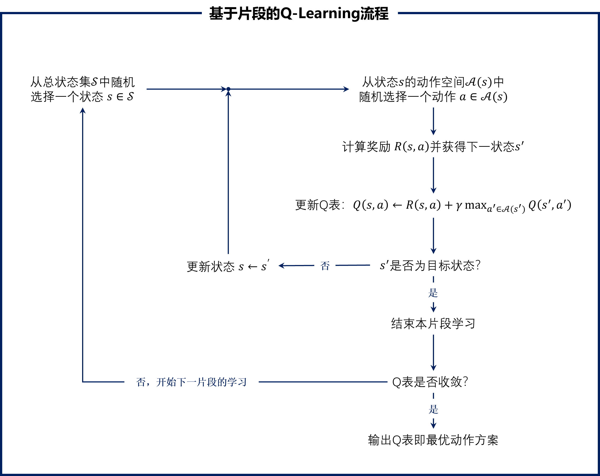
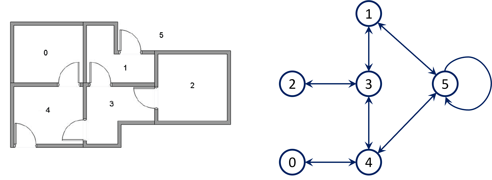
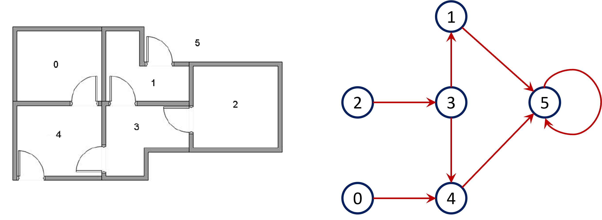

#! https://zhuanlan.zhihu.com/p/680044335
### 强化学习 Q-Learning 入门

Q-Learning是强化学习方法中的一种，适合初学者入门。  
适用条件：状态（state）和动作（action）空间离散且数量少。

状态空间：$\cal S$，维数为 $N_{\rm s}$
动作空间：$\cal A$，维数为 $N_{\rm a}$
某个状态 $s$ 的动作空间：${\cal A}(s)$

#### 一、两张重要的表

**R表**：表示为 ${\bold R}_{N_{\rm s} \times N_{\rm a}}$，其中 $R(s,a)$ 表示在状态 $s$ 下采取动作 $a$ 所得奖励值：

$$
\begin{array}{c}
                    &   &           &  &\text{action}      &       &       & \\
                    &   &1          &2          &3          &4      &\cdots &N_{\rm a} \\ 
                    &1  &R_{1,1}    &R_{1,2}    &R_{1,3}    &R(1,4)&\cdots &R(1, N_{\rm a}) \\
     \text{state}   &2  &R_{2,1}    &R_{2,2}    &R_{2,3}    &R(2,4)&\cdots &R(2, N_{\rm a}) \\
                    &\vdots &\vdots &\vdots &\vdots &\vdots &\ddots &\vdots \\
                    &N_{\rm s} &R(N_{\rm s},1) &R(N_{\rm s},2) &R(N_{\rm s},3) &R(N_{\rm s},4) &\cdots &R(N_{\rm s},N_{\rm a}) \\
\end{array}
$$

**Q表**：表示为 ${\bold Q}_{N_{\rm s} \times N_{\rm a}}$，其中 $Q(s,a)$ 表示在状态 $s$ 下采取动作 $a$ 的Q值（**状态 $s$ 应执行对应于最高Q值的动作 $a$**）：

$$
\begin{array}{c}
                    &   &           &  &\text{action}      &       &       & \\
                    &   &1          &2          &3          &4      &\cdots &N_{\rm a} \\ 
                    &1  &Q(1,1)    &Q(1,2)    &Q(1,3)    &Q(1,4)&\cdots &Q(1, N_{\rm a}) \\
     \text{state}   &2  &Q(2,1)    &Q(2,2)    &Q(2,3)    &Q(2,4)&\cdots &Q(2, N_{\rm a}) \\
                    &\vdots &\vdots &\vdots &\vdots &\vdots &\ddots &\vdots \\
                    &N_{\rm s} &Q(N_{\rm s},1) &Q(N_{\rm s},2) &Q(N_{\rm s},3) &Q(N_{\rm s},4) &\cdots &Q(N_{\rm s},N_{\rm a}) \\
\end{array}
$$

#### 二、Q-Learning 迭代过程

基于片段（episode）的学习：先初始化Q表，将所有的 $Q(s,a)$ 都设为 $0$，然后随机选择初始状态和动作，通过贝尔曼方程迭代不断更新Q表中的值，直至收敛。最终得到**稳定的Q表即最优策略**。

<br> <!-- Add an empty line above the image -->
<div style="text-align:center;">
    
</div>
<br> <!-- Add an empty line below the image -->

其中，Q表中元素的更新遵循如下**贝尔曼方程**（Bellman Equation）：

$$
Q(s,a) \leftarrow Q(s,a) + \alpha \left[R(s, a) + \gamma \max_{a'} Q(s',a') - Q(s, a)\right] \tag{1}
$$

式中，$R$ 是在当前状态 $s$ 执行动作 $a$ 后的奖励；$\max_{a'} Q(s',a')$ 是指在下一状态 $s'$ 取得的最大Q值；$\alpha$ 为学习率，$\gamma$ 为折扣因子。

如果取 $\alpha = 1$，则有

$$
Q(s,a) \leftarrow R(s, a) + \gamma \max_{a'} Q(s',a') \tag{2}
$$

#### 三、简单案例

此案例参见：[CSDN描述](https://blog.csdn.net/itplus/article/details/9361915)

<br> <!-- Add an empty line below the image -->
<div style="text-align:center;">
    
</div>
<br> <!-- Add an empty line below the image -->

已知各房间具有如图所示的连通关系，需要寻找从任一房间前往右上第5个房间的最佳（最短路径）策略。

各房间（即状态）之间的邻接矩阵为：

$$
{\bold A}_{N_{\rm s}\times N_{\rm s}} = \left[
    \begin{array}{c}
        0 &0 &0 &0 &1 &0 \\
        0 &0 &0 &1 &0 &1 \\
        0 &0 &0 &1 &0 &0 \\
        0 &1 &1 &0 &1 &0 \\
        1 &0 &0 &1 &0 &1 \\
        0 &1 &0 &0 &1 &1 \\
    \end{array}
    \right]
$$

R表为（注意这里用到了状态和动作间的**可达信息**；也可将不可达情形下的奖励值设为负数等其他较低的值）：

$$
{\bold R}_{N_{\rm s}\times N_{\rm a}} = \left[
    \begin{array}{c}
         & & & &0 & \\
         & & &0 & &100 \\
         & & &0 & & \\
         &0 &0 & &0 & \\
        0 & & &0 & &100 \\
         &0 & & &0 &100 \\
    \end{array}
    \right]
$$

对于R表中任意元素 $r_{s, a}$，若状态 $s$ 执行动作 $a$ 后达到目标即房间5，则 $r_{s, a}=100$，否则 $r_{s, a} = 0$。（**需思考对奖励值的设计**）

接下来，按照图1中流程对Q表进行学习，Python代码见本文最后。最终得到Q表为：

$$
{\bold Q}_{N_{\rm s}\times N_{\rm a}} = \left[
    \begin{array}{c}
         & & & &\underline{400} & \\
         & & &320 & &\underline{500} \\
         & & &\underline{320} & & \\
         &\underline{400} &256 & &\underline{400} & \\
        320 & & &320 & &\underline{500} \\
         &400 & & &400 &\underline{500} \\
    \end{array}
    \right]
$$

其中，每各状态对应的最优动作Q值已使用下划线标记，对应于下图：

<br> <!-- Add an empty line below the image -->
<div style="text-align:center;">
    
</div>
<br> <!-- Add an empty line below the image -->

#### 四、案例代码

```python
import numpy as np
import random

states = np.arange(6)
actions = np.arange(6)

# ---- 设置奖励矩阵R -----------------------------------------------------------------------------

# 奖励矩阵，行：状态、列：动作、元素：奖励值
R = np.array([
    [-1, -1, -1, -1, 0, -1],
    [-1, -1, -1, 0, -1, 100],
    [-1, -1, -1, 0, -1, -1],
    [-1, 0, 0, -1, 0, -1],
    [0, -1, -1, 0, -1, 100],
    [-1, 0, -1, -1, 0, 100],
])

# 状态邻接矩阵：row -> col
A = np.array([
    [0, 0, 0, 0, 1, 0],
    [0, 0, 0, 1, 0, 1],
    [0, 0, 0, 1, 0, 0],
    [0, 1, 1, 0, 1, 0],
    [1, 0, 0, 1, 0, 1],
    [0, 1, 0, 0, 1, 1],
])

# ---- Q-Learning ------------------------------------------------------------------------------

gamma = 0.8

# 初始化Q矩阵，行：状态、列：动作、元素：Q值
Q = np.zeros((len(states), len(actions)))

# 目标节点
s_end = 5

# 总迭代数, 起始迭代数
iter, i = 1000, 0

while True:
    # 开始Episode: 随机选择一个状态
    s = random.choice(states)
    
    while True:
        # 查看状态s的可达状态，获得可选动作
        cand_states = np.argwhere(A[s, :] > 0).flatten()
        
        # 随机选择一个动作
        cand_actions = cand_states
        a = random.choice(cand_actions)
        
        # 下一状态和奖励
        r = R[s, a]
        s_next = a  # 执行编号a的动作便到达了下个具有相等编号的状态
        
        # 查看状态s_next的可达状态，获得可选动作
        cand_states_next = np.argwhere(A[s_next, :] > 0).flatten()
        
        # 求解max_{a_next} Q(s_next, a_next)
        cand_actions_next = cand_states_next
        max_q = np.max(Q[s_next, cand_actions_next])
        
        # 更新Q元素
        Q[s, a] = r + gamma * max_q
        
        if s_next == s_end:
            break
        else:
            s = s_next
    
    i += 1
    
    # TODO: 需采用Q表收敛判据替代以下部分
    if i == iter:
        break

Q = np.round(Q, 2)
```