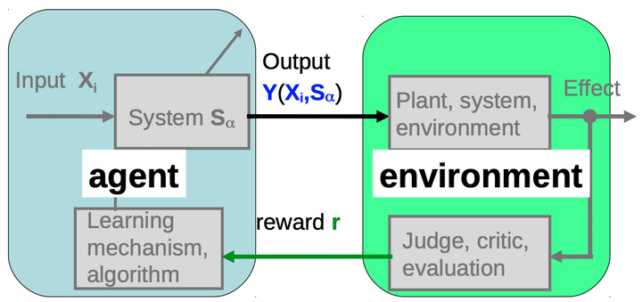
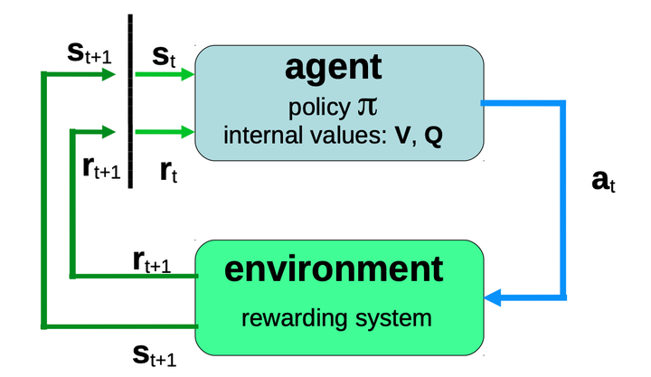

### 贝尔曼方程与Q学习

#### 一、Agent-Environment框架

如下为Agent-Environment框架示例：

{width=300}

{width=300}

其中：
1. Agent：
   * 在每个时刻 $t$ 对环境状态进行观测，获得 $s_t$
   * 按照行为策略 $\pi$ 进行动作 $a_t$；
2. Environment：
   * 在每个时刻状态为 $s_t$
   * 接收来自Agent的动作 $a_t$
   * 在 $a_t$ 影响下产生新状态 $s_{t+1}$
   * 在时刻 $t \rightarrow t+1$ 的状态 $s_t \rightarrow s_{t+1}$ 的变化中，为Agent提供即时反馈即奖励 $R_{s_t \rightarrow s_{t+1}}^{a_t}$

#### 二、关键参数和变量

重要参数：
1. 状态集合（Environment）：$\cal{S} = \{s_1, s_2, \cdots\}$。时刻 $t$ 的状态随机变量为 $S_t$
2. 动作集合（Agent）：$\cal{A} = \{a_1, a_2, \cdots\}$。时刻 $t$ 的动作随机变量为 $A_t$
3. 状态转移概率：$P_{s \rightarrow s'}^a$，表示Environment在状态 $s$ 时接受Agent动作 $a$ 到达下一状态 $s'$ 的概率
4. 即时奖励函数：$R_{s \rightarrow s'}^a$，表示Environment在状态 $s$ 时接受Agent动作 $a$ 到达下一状态 $s'$ 所得即时奖励

策略（policy）的形式：
1. 随机：
   * 权重 $\pi(s, a)$，按照概率确定对应于 $s$ 的动作 $a$
2. 确定：
   * 矩阵 $\pi_{|\cal{S}| \times |\cal{A}|}$，例如：Q学习，对应于状态 $s$ 的动作为 $a(s,\pi) = \argmax_a \pi(s, a)$
   * 映射 $\pi: \cal{S} \rightarrow \cal{A}$

#### 三、马尔可夫决策和Q学习中的贝尔曼方程

**问题提出**：当Environment在时刻 $t$ 处于状态 $s$ 且接收动作为 $a$ 时，对Agent的策略 $\pi$ 进行优化，使得至此开始（一段连续时期内）Agent所接收的总（期望）奖励值最大，即

$$
\begin{align*} \tag{1}
    \max_{\pi}\quad Q_{\pi}(S_t = s, A_t = a) = {\mathbb E}_{\pi}\left[
        R_{t+1} + \gamma R_{t+2} + \gamma^2 R_{t+3} + \cdots | S_t = s, A_t = a 
    \right]
\end{align*}
$$

对目标函数进行推导：

$$
\begin{align*}
    Q_{\pi}(S_t = s, A_t = a) &= {\mathbb E}_{\pi}\left[
        R_{t+1}| S_t = s, A_t = a\right] + \gamma{\mathbb E}_{\pi}\left[
            R_{t+2} + \gamma R_{t+3} + \cdots | S_t = s, A_t = a
    \right] \\ \tag{2}
    &= \sum_{s'\in\cal S}P_{s\rightarrow s'}^aR_{s\rightarrow s'}^a + \gamma Q_{\pi}(S_{t+1}, A_{t+1}|S_t = s, A_t = a)
\end{align*}
$$

其中

$$
\begin{align*} \tag{3}
    Q_{\pi}(S_{t+1}, A_{t+1}|S_t = s, A_t = a) = \sum_{s'\in\cal S} P_{s\rightarrow s'}^a \sum_{a'\in\cal A} \pi(s', a') Q_{\pi}(S_{t+1} = s', A_{t+1} = a'|S_t = s, A_t = a)
\end{align*}
$$

因此

$$
\begin{align*}
    Q_{\pi}(S_t = s, A_t = a) &= {\mathbb E}_{\pi}\left[
        R_{t+1}| S_t = s, A_t = a\right] + \gamma{\mathbb E}_{\pi}\left[
            R_{t+2} + \gamma R_{t+3} + \cdots | S_t = s, A_t = a
    \right] \\ \tag{4}
    &= \sum_{s'\in\cal S}P_{s\rightarrow s'}^a R_{s\rightarrow s'}^a + \gamma \sum_{s'\in\cal S} P_{s\rightarrow s'}^a \sum_{a'\in\cal A} \pi(s', a') Q_{\pi}(S_{t+1} = s', A_{t+1} = a') \\
    &= \sum_{s'\in\cal S}P_{s\rightarrow s'}^a \left(
        R_{s\rightarrow s'}^a + \gamma \sum_{a'\in\cal A} \pi(s', a') Q_{\pi}(S_{t+1} = s', A_{t+1} = a')
    \right)
\end{align*}
$$

省去各状态和动作的随机变量表达，将上式简写作：

$$
\begin{align*}
    Q_{\pi}(s, a) 
    &=  \sum_{s'\in\cal S}P_{s\rightarrow s'}^a \left(
        R_{s\rightarrow s'}^a + \gamma \sum_{a'\in\cal A} \pi(s', a') Q_{\pi}(s', a')
    \right) \\ \tag{5}
    &= \sum_{s'\in\cal S}P_{s\rightarrow s'}^a R_{s\rightarrow s'}^a + \gamma\sum_{s'\in\cal S}P_{s\rightarrow s'}^a\sum_{a'\in\cal A} \pi(s', a') Q_{\pi}(s', a')
\end{align*}
$$

**如果奖励函数仅与当前时刻状态和动作有关**，则 $R_{s\rightarrow s'}^a = R_{s}^a$，

$$
\begin{align*}
    Q_{\pi}(s, a)
    &= R_{s}^a + \gamma\sum_{s'\in\cal S}P_{s\rightarrow s'}^a\sum_{a'\in\cal A} \pi(s', a') Q_{\pi}(s', a') \\ \tag{6}
    &= R_{s}^a + \gamma\sum_{s'\in\cal S}P_{s\rightarrow s'}^a \sum_{a'\in\cal A} \cdot \pi(s', a') Q_{\pi}(s', a') \\
\end{align*}
$$

进一步地，**如果在任意状态 $s$ 进行动作 $a$ 后得到的下一状态 $s'$ 是唯一而非随机**的，则上式进一步可写作

$$
\begin{align*}
    Q_{\pi}(s, a)
    &= R_{s}^a + \gamma\sum_{a'\in\cal A} \pi(s', a') Q_{\pi}(s', a') \tag{7}\\
\end{align*}
$$

**如果对应于状态 $s$ 的最优动作由Q表最大值确定**：

$$
a^*(s, \pi) = \pi^*(s) = \argmax_a Q_{\pi}(s, a) \tag{8}
$$

那么

$$
\pi(s', a') = \left\{
    \begin{array}{ll}
    1, \text{if } a' =\pi^*(s') \tag{9}\\
    0, \text{else}
    \end{array}
\right.
$$

则将式(9)代回式(7)有：

$$
\begin{align*}
    Q_{\pi}(s, a)
    &= R_{s}^a + \gamma\cdot Q_{\pi}\left(s', \argmax_{a'} Q_{\pi}(s', a')\right) \tag{10}\\
\end{align*}
$$

最终得到Q学习的贝尔曼方程：

$$
\begin{align*}
    Q_{\pi}(s, a)
    &= R_{s}^a + \gamma\cdot \max_{a'} Q_{\pi}(s', a') \tag{11}\\
\end{align*}
$$

其中，$s'$ 是由 $s$ 和 $a$ 共同决定的下一状态值。

#### 四、Q学习迭代步骤

在式(11)中对应于Q学习的贝尔曼方程基础上，可通过如下的迭代方式对Q矩阵进行学习：

$$
\begin{align*}
    Q_{\pi}(s, a)
    \leftarrow (1 - \alpha)\cdot Q_{\pi}(s, a) + \alpha\left[ R_{s}^a + \gamma\cdot \max_{a'} Q_{\pi}(s', a') \right] \tag{12}\\
\end{align*}
$$

最终所得收敛结果即为最优Q表。其中
* $\alpha$：学习率
* $\gamma$：衰减系数
* $R_s^a$：Agent在Environment状态为 $s$ 时采取动作 $a$ 所得即时奖励值

