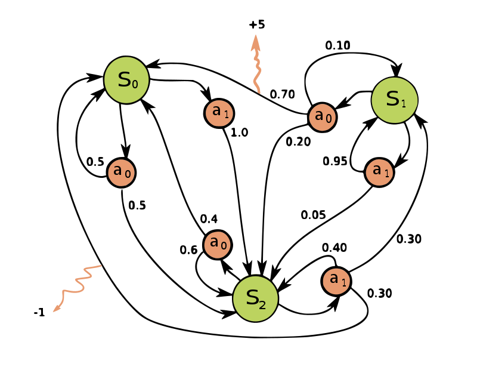
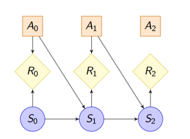

## 马尔可夫决策和Bellman方程

- **马尔可夫链**（Markov Chain，MC）主要用于预测和模拟随机过程

- **马尔可夫决策过程**（Markov Decision Process，MDP）则用于在**不确定环境**中做出**最优决策**。不确定环境导致了过程的随机性和概率表达。

#### 一、马尔可夫链

形如：

$$
\cdots \rightarrow X_{t-2} \rightarrow X_{t-1} \rightarrow X_{t} \rightarrow X_{t+1} \rightarrow X_{t+2} \rightarrow \cdots \tag{1}
$$

被称为马尔可夫过程（Markov Process，MP），又名马尔可夫链。式(1)中任意时刻 $X$ 的状态仅由上一时刻决定，因此为**1 阶马尔可夫链**。
 
**状态空间**：

- 状态空间 $\cal X$表示 $X$ 的所有可能取值的集合（即认为 $X$ 只具备有限个状态）；

- 如果 $X$ 具有 $N$ 个状态，对应的状态概率为 $P_1, P_2, \cdots, P_N > 0$，则

$$
\sum_{i=1}^N P_i = 1
$$

**转移概率**：

- 如果使用 $P_{i, j}$ 表示状态 $i$ 至状态 $j$ 的转移概率，则状态转移矩阵为：

$$
\bm{P}_{N\times N} = \left[\begin{matrix}
    P_{1, 1} &\quad P_{1, 2} &\quad \cdots &\quad P_{1, N} \\
    P_{2, 1} &\quad P_{2, 2} &\quad \cdots &\quad P_{2, N} \\
    \vdots   &\quad \vdots   &\quad \ddots &\quad \vdots \\
    P_{N, 1} &\quad P_{N, 2} &\quad \cdots &\quad P_{N, N} \\
\end{matrix}\right]
$$

其中，

$$
\begin{aligned}
    & 0 \leq P_{i,j} \leq 1, \forall i \in \{1, \cdots, N\}, j \in \{1, \cdots, N\} \\
    &\qquad\qquad \sum_{j=1}^N P_{i,j} = 1, \forall i \in \{1, \cdots, N\} \\
\end{aligned}
$$

**马尔可夫链中的信息屏蔽**：

比如在式(1)中的**1 阶马尔可夫链**中，

$$
P(X_t|X_{t-1}, X_{t-2}, \cdots) = P(X_t|X_{t-1}) \tag{2}
$$

即 $X_{t-1}$ 屏蔽了 $X_{t-2}$ 等更早的变量对于 $X_t$ 的影响。这将极大地简化对 $X_t$ 的概率计算复杂度。

**马尔可夫链时齐性（Time-homogeneous）**

导致：状态转移概率与时间无关。

**马尔可夫链各态遍历性（Ergodicity）和常返（Recurrence）**

各态遍历性：各种状态都能（在概率上）都能达到，所有状态能被取到的概率均严格大于0；
各态常返：马尔科夫链中，经过有限步转移后返回自身的状态。

#### 二、马尔可夫决策过程

##### <u>2.1 过程描述</u>

如下图所示，一个 MDP 可由四元组 $({\cal S},{\cal A},P_a,R_a)$ 表示：

- $\cal S$：**状态集合**，如图中的 $\left\{S_0,S_1,S_2\right\}$

- $\cal A$：**动作集合**，如图中的 $\left\{a_0,a_1\right\}$

- $P_{s,s'}^a$：**转移概率**。具体地，当系统在时刻 $t$ 处于状态 $s \in \cal S$ 时，此时采取决策动作 $a$ 后，系统在下个时刻 $t+1$ 的状态为 $s'\in {\cal S}$ 的概率为 $P_{s, s'}^a = P(s_{t+1} = s'|s_t = s, a_t = a)$

- $R_{s,s'}^a$：**决策奖励**，当系统状态从 $s$ 转移至 $s'$ 后立即（或期望立即）获得的奖励

为计算方便，也可将MDP沿着时序方向展开：

**注意：MDP变量间还存在如下的关系**：

- 在当前状态为 $s$ 时，选择动作 $a$ 的概率为：$\pi(s, a) \in (0, 1)$；
- 在当前状态为 $s$ 时，通过动作 $a$ 使得下一状态为 $s'$ 的概率为：$P_{s, s'}^a \in (0, 1)$；
- 当前状态为 $s$，选择动作 $a$ 到达下一状态 $s'$ 的概率为：$\pi(s, a) * P_{s, s'}^a$；
- 当前状态为 $s$，到达下一状态为 $s'$ 的概率为：$\sum_a \pi(s, a)P_{s, s'}^a$；

##### <u>2.2 优化目标</u>

在MDP中：

1. 一旦策略 $\pi$ 确定，那么对于任意时刻 $t$ 状态为 $s$，系统在本时刻的奖励（价值）为如下的期望形式：

    $$
    R_{t+1} = \sum_a \pi(s, a)\sum_{s'}P_{s, s'}^aR_{s, s'}^a = \mathbb{E}_{\pi}\left[\sum_{s'}P_{s, s'}^aR_{s, s'}^a\Big|S_t = s \right] \tag{3}
    $$

2. 系统状态也具有时序上的递推关系。系统在下一时刻取得状态 $s'$ 的概率为：

    $$
    P(S_{t+1} = s'|S_t = s) = \sum_a \pi(s, a) P_{s, s'}^a \tag{4}
    $$

综合上述讨论1、2可知，一旦策略 $\pi: \cal{S} \rightarrow \cal{A}$ 确定，系统在时序上的状态转移关系和对应的奖励函数便确定了。

**MDP优化问题为：已知系统在某时刻 $t = t_0$ 的状态 $S_t = s$，求解系统状态空间到动作空间的最佳映射即策略 $\pi^*: {\cal S} \rightarrow {\cal A}$，使得系统在当前及未来所有时刻取得的总（期望）奖励最高**，即

$$
\begin{aligned} \tag{5}
    \max\limits_{\pi: {\cal S} \rightarrow {\cal A}} &\quad {\mathbb E}_{\pi}\left[R_{t+1} + \gamma R_{t+2} + \gamma^2 R_{t+3} + \cdots \big|S_t = s\right] \\
\end{aligned}
$$

注意，由于**环境的复杂性和随机性（信息衰减）**，未来的奖励往往比当前的奖励更加不确定，因此在优化过程中需要谨慎地权衡眼前的奖励和未来的奖励，因此式(5)中引入了折扣因子 $0\leq\gamma\leq1$（一般接近1）。

##### <u>2.3 Bellman方程</u>

令

$$
v_{\pi}(S_t = s) = {\mathbb E}_{\pi}\left[R_{t+1} + \gamma R_{t+2} + \gamma^2 R_{t+3} + \cdots \big|S_t = s\right] \tag{6}
$$

则有

$$
\begin{aligned} \tag{7}
    v_{\pi}(S_t = s) &= {\mathbb E}_{\pi}\left[R_{t+1} + \gamma\left(R_{t+2} + \gamma R_{t+3} + \cdots\right) \big|S_t = s\right] \\
    &= {\mathbb E}_{\pi}\left[R_{t+1}|S_t = s\right] + \gamma\left[\red{v_{\pi}(S_{t+1} \big|S_t = s)}\right]\\
\end{aligned}
$$

式(7)便为**Bellman方程**。

注意式(7)中的红色部分，表示系统在当前时刻 $t$ 的状态 $S_t = s$ 的情况下，在**接下来所有时刻 $t+1, t+2, \cdots, \infty$ 取得的总期望奖励**。我们只知道 $S_t = s$，但并不确定 $S_{t+1}$ 是什么状态，因此，需要把所有可能的过程都遍历出来计算期望，因此

$$
v_{\pi}(S_{t+1} \big|S_t = s) = \sum_a \pi(s, a) \sum_{s'} P_{s, s'}^a v_{\pi}(s') \tag{8}
$$

而式(7)等式右侧第一项为

$$
\mathbb{E}_{\pi}\left[R_{t+1}|S_t = s\right] = \sum_a \pi(s, a)\sum_{s'} P_{s, s'}^a R_{s, s'}^a \tag{9}
$$

代入式(7)可得

$$
\begin{aligned} \tag{10}
    v_{\pi}(S_t = s) &= \sum_a \pi(s, a)\sum_{s'} P_{s, s'}^a \left(R_{s, s'}^a + \gamma v_{\pi}(s')\right)
\end{aligned}
$$

根据式(6)中对总期望函数 $v_{\pi}(s)$ 的定义，如果系统满足各态遍历且各态常返，则系统在未来时刻任意状态 $s'$ 均可在历史中找到相同情形，因此，可消去式(11)奖励函数中的时间下标 $t$，得到

$$
\begin{aligned} \tag{11}
    v_{\pi}(s) &= \sum_a \pi(s, a)\sum_{s'} P_{s, s'}^a \left(R_{s, s'}^a + \gamma v_{\pi}(s')\right)
\end{aligned}
$$

式(11)中，一旦策略函数 $\pi(s, a)$ 确定，则总期望奖励 $v_{\pi}(s)$ 便可被唯一确定（可通过迭代求解）。因此可通过优化获得最优的策略 $\pi^*$ 使得 $v_{\pi^*}(s)$ 最大化。

##### <u>2.4 基于Bellman方程的动态规划</u>

基于Bellman方程的两类基本问题：
1. 预测问题：根据下述已知条件，求解对应于给定策略 $\pi$ 的价值函数 $v_{\pi}(s)$
   - 状态集合：$\cal S$
   - 动作集合：$\cal A$
   - 状态转移概率：$P_{s, s'}^a$，$\forall s, s'\in {\cal S}, a \in {\cal A}$
   - 奖励函数：$R_{s, s'}^a$，$\forall s, s'\in {\cal S}, a \in {\cal A}$
   - 衰减因子：$\gamma$
   - <u>给定的策略</u>：$\pi$
2. 控制问题：根据下述已知条件，求解最优策略 $\pi^*$ 使得价值函数最大，$v^*(s)=v_{\pi^*}(s)$
   - 状态集合：$\cal S$
   - 动作集合：$\cal A$
   - 状态转移概率：$P_{s, s'}^a$，$\forall s, s'\in {\cal S}, a \in {\cal A}$
   - 奖励函数：$R_{s, s'}^a$，$\forall s, s'\in {\cal S}, a \in {\cal A}$
   - 衰减因子：$\gamma$

###### <u>2.4.1 预测问题求解——策略评估（Policy Evaluation）</u>

从任意一个状态价值函数开始，依据给定的策略，结合Bellman期望方程、状态转移概率和奖励同步迭代更新状态价值函数，**直至收敛**。

第 $k$ 步的迭代过程如下：

$$
\begin{aligned} \tag{12}
    v_{k + 1}(s) &= \sum_a \pi(s, a)\sum_{s'} P_{s, s'}^a \left(R_{s, s'}^a + \gamma v_{k}(s')\right)
\end{aligned}
$$

###### <u>2.4.2 控制问题求解——策略迭代（Policy Iteration）</u>

主要计算步骤如下，其中第2步和第3步对状态价值和动作分别评价，相互耦合：

1. 初始化：
   - 状态价值函数 $v(s) \in {\rm R}, \forall s \in \cal{S}$
   - 策略函数 $\pi(s, a), \forall s \in \cal{S}, a \in {\cal A}$
2. 策略评价：
   - 对于每个状态 $s \in {\cal S}$
     - 从上一步结果获得价值 $v \leftarrow v(s)$
     - 计算当前状态价值：
       - $a_{\rm c} \leftarrow \argmax_a \pi(s, a)$
       - $v_{\rm n} \leftarrow \sum_{s'}P_{s, s'}^{a_{\rm c}}\left(R_{s, s'}^{a_{\rm c}} + \gamma v(s')\right)$
     - 计算变化量 $\Delta_s \leftarrow |v - v_{\rm n}|$
   - 如果对于所有状态 $s$ 都有 $\Delta_s < \varepsilon$，终止迭代；否则，重复上述迭代。
3. 策略提升：
   - 对于每个状态 $s \in {\cal S}$
     - 获得当前动作 $a_{\rm c}(s) \leftarrow \argmax_a \pi(s, a)$
     - 计算新的动作 $a_{\rm n}(s) \leftarrow \argmax_a \sum_{s'}P_{s, s'}^a\left(R_{s, s'}^a + \gamma v(s')\right)$
   - 如果对于每个动作 $s \in {\cal S}$ 都有 $a_{\rm c}(s) = a_{\rm n}(s)$，则终止迭代；否则回到“策略评价”步骤。

**注意：策略迭代算法在第三步“策略提升”的“计算新的动作”过程中对策略 $\pi$ 进行了优化**。

